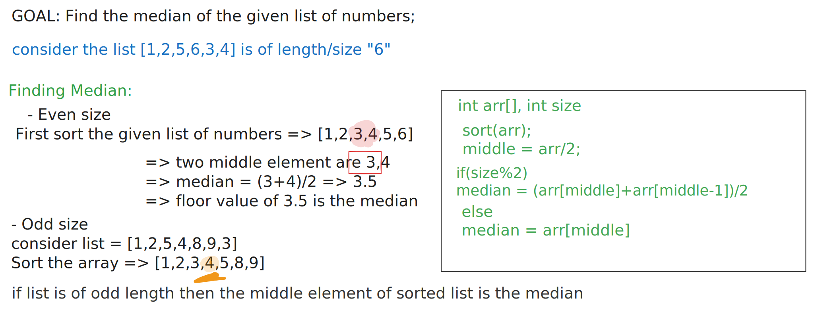

## Find Median of the given array of numbers

# Steps:

1.  Sort the array in ascending order
2.  ## Median:
    - Median is the middle element of the sorted list of numbers, if list is of odd length.
    - Median = floor value of average of the two middle elements in the list, if list is of even length.

