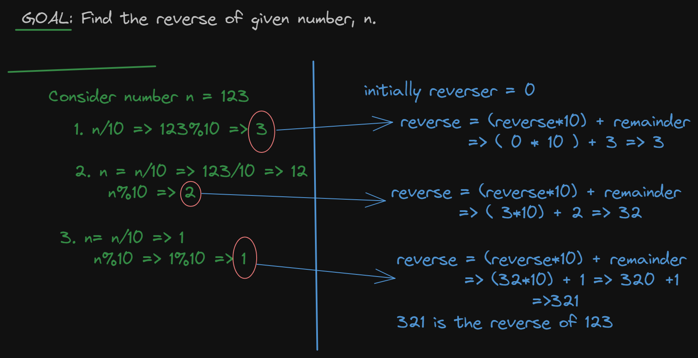

## Reverse of given number.

To find the reverse of number n(consider n = 456):

- initially reverse number call it reverse = 0

1. Find the last digit of n by (6): This is the remainder from dividing the n by 10
2. reverse = reverse\*10 + remainder;
3. In next step n is step to n/10 (quotient) (i.e now n = 45)
   Repeat the steps 1,2,3 untill the quotient is 0

   
